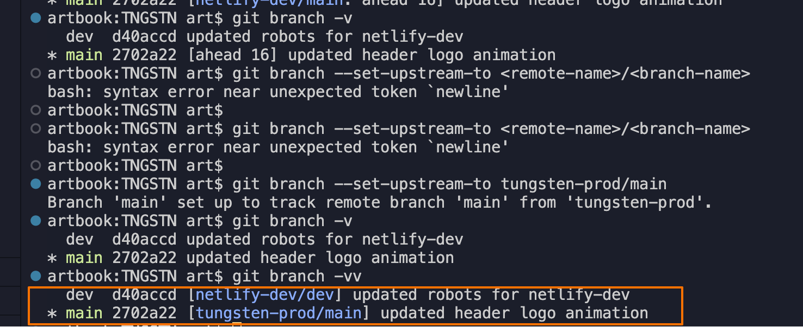

# Updates Workflow

## 2 Branches:

### `dev` - for development

This branch is 'wired' to https://github.com/vitamineart/tngstn repo (it has only one default branch - `dev`). Changes from the repo are automatically being deployed to tngstn.netlify.app website for preview.

### `main` - for production

This branch is 'wired' to https://github.com/tungstenadvertising/tngstn (it has only one default branch - `main`) production website.


### how to

Set the preferred remote for the current (checked out) branch:
`git branch --set-upstream-to <remote-name>/<branch-name>`

Validate the branch is setup with the correct upstream remote:
`git branch -vv`

## Based on Gulp with TailwindCSS Starter Kit

Gulp with TailwindCSS Starter Kit ( Updated with [TailwindCSS JIT](https://github.com/tailwindlabs/tailwindcss-jit) )- A repo which makes your development easier with predefined gulp tasks that help you to use [tailwindcss](https://github.com/tailwindcss/tailwindcss) with simple npm commands

## Usage

1. Install Dev Depedencies

```sh
npm install // or yarn install
```

2. To start development and server for live preview

```sh
npm run dev // or yarn dev
```

3. To generate minifed files for production server

```sh
npm run prod // or yarn prod
```

# Configuration

To change the path of files and destination/build folder, edit options in **config.js** file

```sh
{
  config: {
      ...
      port: 9050 // browser preview port
  },
  paths: {
     root: "./",
     src: {
        base: "./src",
        css: "./src/css",
        js: "./src/js",
        img: "./src/img"
     },
     dist: {
         base: "./dist",
         css: "./dist/css",
         js: "./dist/js",
         img: "./dist/img"
     },
     build: {
         base: "./build",
         css: "./build/css",
         js: "./build/js",
         img: "./build/img"
     }
  }
  ...
}
```
